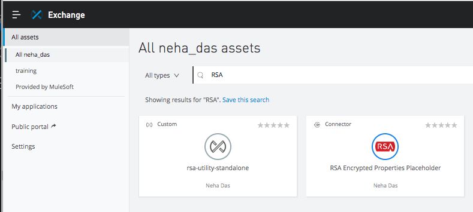
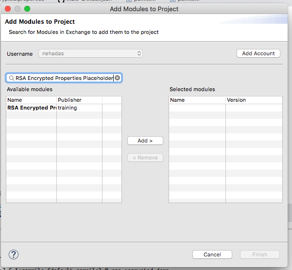
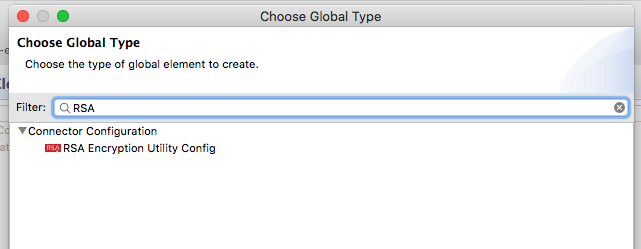
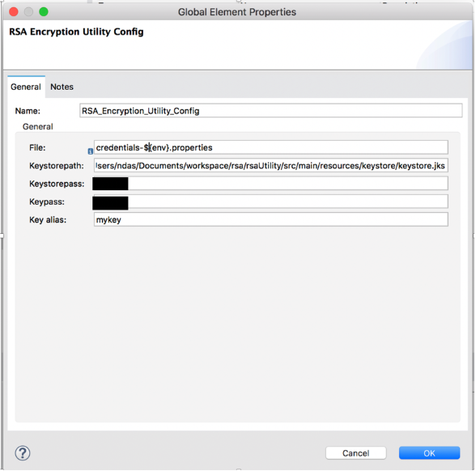

# RSA based Secure Properties Placeholder Module
## Context
Mule 4 provides Secure Configuration properties , which enables to create secure configuration properties by encrypting them.

For more information , please refer to the below references :

https://docs.mulesoft.com/mule-runtime/4.1/secure-configuration-properties

## Limitations of Secure Configuration Properties file
This approach requires the encryption key to be passed as a JVM runtime parameter and hence suffers certain limitations and security threats. These are explained here , along with the some mitigation actions:

1. When you include the secret encryption key as a JVM argument, the value is stored in the $MULE_HOME/conf/wrapper-additional.conf file. Be sure to protect access to this file to avoid compromising your encrypted secure properties.

2. Administrative commands such as the ps command in UN*X or the tasklist command in Windows list all the JVM arguments used to start a Mule runtime, including the secret encryption key value, so access to these commands should also be restricted to trusted administrators.

Though the scenarios just mentioned satisfy most of the use cases but often customers express that these are not enough,and rightly so. There are situations where you need to hide the secret encryption key value from other users of the operating system, that is, you must not show the secret encryption key as a JVM parameter, since it is visible to anyone having access to the process.

## Solution
A solution for this is to implement a custom secure property placeholder that can read the encryption key in a different way, for example from a file located in a protected folder or RSA public private key pair ( keystore ).

## RSA Secure Properties Placeholder Module
In order to alleviate few of the concerns around passing the encryption key as a JVM parameter to the OOTB secure configuration properties explained in the earlier section, a custom module has been created. This module encrypts and decrypts secure properties key value using a keystore ( jks containing public / private key pair) , eliminating the need to explicitly store and pass the encryption key as a JVM parameter or storing in wrapper.conf.

## Publishing the module to the Exchange
1. Check out this project on to your local desktop
2. Configure the Exchange2 credentials to the Maven settings.xml
3. Navigate to the Project folder and execute the below command
```
./deploy.sh <YOUR_ORG_ID>
```
The script will basically run the command mvn clean deploy to deploy the  RSA Encrypted Properties Placeholder into your own Exchange.

Optinally , you can also upload the Encryption Utiling JAR as well in the Exchange so that the developers can use it for local development.



## Installing the extension in the Anypoint Studio
Open your Mule project in Anypoint Studio.
Go to the Mule Palette.
Select Search in Exchange, and search for the "RSA Encrypted Properties Placeholder".



Add the extension.

OR

Add the below dependency to your pom.xml
```
<dependency>
            <groupId><YOUR_ORG_ID></groupId>
            <artifactId>rsa-encrypted-properties</artifactId>
            <version>1.0.0</version>
            <classifier>mule-plugin</classifier>
        </dependency>
```
Replace <YOUR_ORG_ID> with your Anypoint Platform Org ID

## Adding Secure Configuration Properties to your App
1. Configure RSA Encryption Utility Config





Sample Configuration
```
<?xml version="1.0" encoding="UTF-8"?>


<mule xmlns:json-logger="http://www.mulesoft.org/schema/mule/json-logger"xmlns:secure-properties="http://www.mulesoft.org/schema/mule/secure-properties"

       xmlns:rsa-encryption-utility="http://www.mulesoft.org/schema/mule/rsa-encryption-utility"

       xmlns:tls="http://www.mulesoft.org/schema/mule/tls"xmlns:http="http://www.mulesoft.org/schema/mule/http" xmlns:trust-store-utility="http://www.mulesoft.org/schema/mule/trust-store-utility"xmlns="http://www.mulesoft.org/schema/mule/core"xmlns:doc="http://www.mulesoft.org/schema/mule/documentation"xmlns:xsi="http://www.w3.org/2001/XMLSchema-instance"xsi:schemaLocation="http://www.mulesoft.org/schema/mule/core http://www.mulesoft.org/schema/mule/core/current/mule.xsd

….

..

 http://www.mulesoft.org/schema/mule/json-logger/current/mule-json-logger.xsd">


<global-property doc:name="Global Property" doc:id="d8d0ea09-4512-4108-87b9-1300fbcaf4cb" name="env" value="local" />

       <rsa-encryption-utility:configname="RSA_Encryption_Utility_Config" doc:name="RSA Encryption Utility Config" doc:id="57ceb587-9ddb-42b0-b5cd-c710f432d1bc" file="credentials-${env}.properties" keystorepath="${keystore.path}" keystorepass="${keystore.pass}"  keypass="${key.pass}" keyAlias="${key.alias}" />

       <configuration-properties doc:name="Configuration properties"doc:id="046a35b8-c4c9-4682-9835-6bd738a0e612" file="credentials-${env}.properties" />

       <flow name="testFlow" doc:id="5690863e-6104-482d-a89f-f8eb30b00ae7" >

              <http:listener doc:name="Listener" doc:id="9683839a-2585-42f7-997b-9749381d9450" config-ref="HTTP_Listener_config" path="/hello"allowedMethods="POST"/>

<logger level="INFO" doc:name="Logger" doc:id="75ff9661-90b7-4c5b-9921-a1828f4fb0c9" message="${rsaEncrypt::testKey}"/>

       </flow>

</mule>         
```
2. Pass the keystore config properties as a runtime parameter or global config.
3. Encrypt the properties file values , as explained in the [README of the standalone encryption utility](https://github.com/mulesoft-consulting/rsa_encrypted-properties-placeholder/tree/master/rsa-encryption-utility).
4. To use an encrypted property , use it as below. The properties file key enclosed in ${} and with prefix rsaEncrypt::
For example :
```
${rsaEncrypt::testKey}
```
